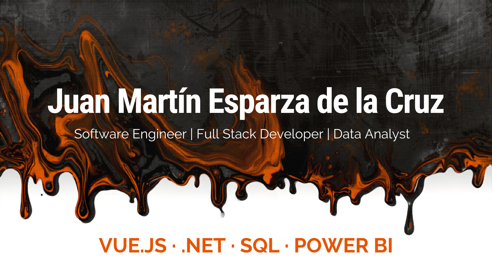

  

<h1 align="center">👋 Juan Martín Esparza de la Cruz</h1>

  
  
  
  

Software Engineer | Full Stack Developer | Process Automation | Data Analytics

Apasionado por construir soluciones digitales que generen impacto real mediante software, automatización y análisis de datos.

📍 Aguascalientes, México

---

## 🚀 Sobre mí

Soy **Ingeniero en Desarrollo y Gestión de Software** con experiencia en desarrollo web, aplicaciones móviles, automatización de procesos industriales y análisis de datos.

He participado en proyectos para instituciones gubernamentales y empresas del sector automotriz, desarrollando soluciones escalables orientadas a optimizar procesos, visualizar información estratégica y mejorar la toma de decisiones.

Actualmente me desempeño como **Desarrollador de Software** en el Instituto de Educación de Aguascalientes (IEA), colaborando en aplicaciones web y móviles basadas en arquitecturas modernas y APIs REST.

### 🎯 Intereses Profesionales

- Desarrollo Full Stack
- Arquitectura de Software
- Automatización de Procesos
- Aplicaciones Empresariales
- Data Analytics & BI
- Transformación Digital
- Desarrollo Móvil
- DevOps y CI/CD

---

## 🛠️ Tecnologías y Herramientas

### Frontend

  

### Backend

  

### Bases de Datos

  
  

### Desarrollo Móvil

  
  
  
  

### Cloud & DevOps

  

### Data & Analytics

  
  

---

## 💼 Experiencia Profesional

### Instituto de Educación de Aguascalientes (IEA)

**Desarrollador de Software**

- Desarrollo de aplicaciones web institucionales con Vue.js
- Integración de APIs REST
- Sistemas georreferenciados mediante Leaflet
- Aplicaciones móviles con React Native
- Integración con servicios desarrollados en .NET

---

### Nissan Mexicana

**Supervisor de Digitalización y Procesos**

- Liderazgo de iniciativas de transformación digital
- Automatización de procesos industriales
- Desarrollo de aplicaciones internas
- Sistemas de monitoreo KPI en tiempo real
- Gestión y coordinación de equipos multidisciplinarios

---

### 📊 Experiencia Adicional

- Analista de Sistemas de Calidad
- Data & Process Analyst
- Full Stack Intern
- Soporte Técnico e Infraestructura

---

## 🌟 Proyectos Destacados

### FLWRSTORE

Tienda en línea especializada en productos de K-Pop, desarrollada con enfoque en experiencia de usuario, administración de productos y escalabilidad para comercio electrónico.

**Características**

* Catálogo dinámico de productos
* Gestión de inventario
* Diseño responsive
* Experiencia de compra optimizada
* Panel administrativo
* Integración con servicios web

**Tecnologías**

* Vue.js
* JavaScript
* CSS3
* Firebase
* GitHub Actions

🔗 Sitio: https://flwrstore.com.mx

---

### Mi Portal IEA Mobile

Aplicación móvil institucional desarrollada con React Native y Expo para facilitar el acceso a información y servicios del Instituto de Educación de Aguascalientes.

**Características**

* Autenticación de usuarios
* Consulta de información institucional
* Consumo de APIs REST
* Experiencia multiplataforma (Android / iOS)
* Integración con servicios gubernamentales

**Tecnologías**

* React Native
* Expo
* JavaScript
* REST APIs
* .NET Backend

🔗 Sitio: CENSURADO POR POLITICAS DE PRIVACIDAD

---

### TaskRanger

Aplicación móvil para gestión de actividades, supervisión operativa y seguimiento geolocalizado orientada a procesos industriales.

**Tecnologías**

* Ionic
* Angular
* Firebase
* TypeScript
* Geolocalización

🔗 Sitio: https://task-ranger-jcbc5a7k0-martindelacruz69.vercel.app

---

### Digitalización de Procesos Industriales

Proyecto enfocado en la transformación digital de procesos de manufactura mediante captura digital de producción, monitoreo de indicadores y análisis en tiempo real.

**Tecnologías**

* Power Apps
* Power BI
* SharePoint
* Excel Online

🔗 Sitio: CENSURADO POR POLITICAS DE PRIVACIDAD

---

### Sistemas Georreferenciados Educativos

Desarrollo de aplicaciones web para consulta y visualización geográfica de información educativa mediante mapas interactivos y servicios especializados.

**Tecnologías**

* Vue.js
* Leaflet
* .NET
* REST APIs

🔗 Sitio: CENSURADO POR POLITICAS DE PRIVACIDAD

---

## 📊 GitHub Analytics

  

---

## 🔥 Contribution Streak

  

---

## 🌱 Actualmente

- Profundizando en .NET y Arquitectura de Software
- Construyendo aplicaciones Full Stack modernas
- Explorando DevOps y CI/CD
- Mejorando prácticas de diseño y escalabilidad
- Buscando nuevos retos profesionales remotos

---

## 🎓 Formación

**Maestría en Desarrollo de Software**  
Instituto Universitario Veracruzano *(Título en proceso)*

**Ingeniería en Desarrollo y Gestión de Software**  
Universidad Tecnológica de Aguascalientes

---

## 🌎 Idiomas

- 🇲🇽 Español — Nativo
- 🇺🇸 Inglés — B2

---

## 📫 Contacto

📧 **martindelacruz169@gmail.com**

💻 **GitHub:** https://github.com/MartinDeLaCruz69

💼 **LinkedIn:** [Juan Martín Esparza de la Cruz](https://www.linkedin.com/in/juanmartinesparzadelacruz)

---

*"Building software that transforms processes into opportunities."*

